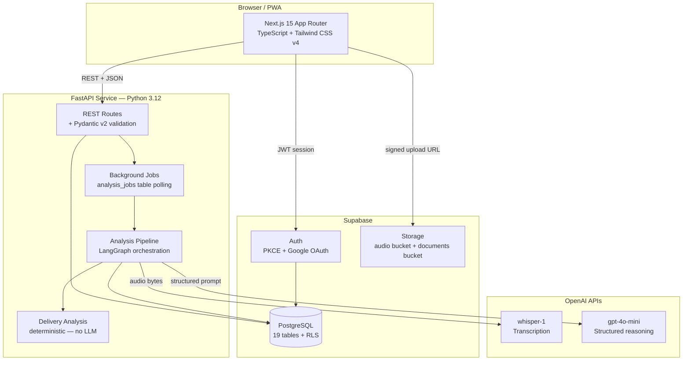
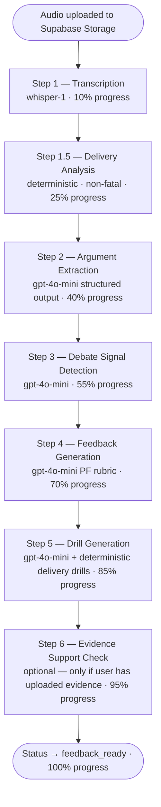
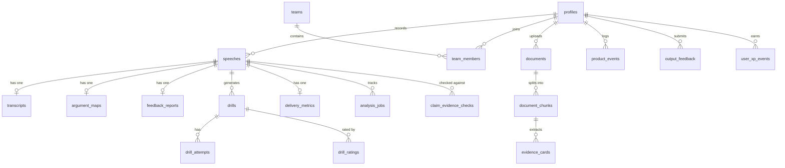

# RoundLab

**AI flow coach for novice and JV Public Forum debaters.**

RoundLab is a full-stack practice platform that closes the coaching gap for students without consistent access to a coach. Record a speech, receive judge-style feedback, complete skill-targeted drills, and track measurable improvement across sessions.

---

## Table of Contents

1. [Overview](#overview)
2. [Product Philosophy](#product-philosophy)
3. [Feature Matrix](#feature-matrix)
4. [System Architecture](#system-architecture)
5. [AI Analysis Pipeline](#ai-analysis-pipeline)
6. [Tech Stack](#tech-stack)
7. [Database Schema](#database-schema)
8. [Project Structure](#project-structure)
9. [Setup](#setup)
10. [Environment Variables](#environment-variables)
11. [Running Tests](#running-tests)
12. [API Reference](#api-reference)
13. [Frontend Pages and Components](#frontend-pages-and-components)
14. [Evaluation Harness](#evaluation-harness)
15. [Delivery Coach](#delivery-coach)
16. [Evidence Library](#evidence-library)
17. [Gamification](#gamification)
18. [Team Features](#team-features)
19. [First-Run Onboarding and Demo Mode](#first-run-onboarding-and-demo-mode)
20. [Async Analysis Jobs](#async-analysis-jobs)
21. [Pilot Testing Protocol](#pilot-testing-protocol)
22. [Analytics Events](#analytics-events)
23. [Current Limitations](#current-limitations)
24. [Roadmap](#roadmap)
25. [Deployment](#deployment)
26. [Screenshots](#screenshots)
27. [Contributing](#contributing)
28. [License](#license)
29. [Status](#status)

---

## Overview

RoundLab processes PF debate speeches through a seven-step AI pipeline and returns four artifacts: a structured argument flow, a judge-style coaching report scored against PF rubrics, three personalized practice drills, and a delivery analysis with a pacing timeline. Students can re-record after completing a drill and view a side-by-side improvement comparison.

**Core workflow:**

1. Record or upload a 45–90 second PF speech (constructive, rebuttal, summary, final focus, crossfire)
2. Whisper transcribes the audio
3. The pipeline extracts every claim, warrant, evidence citation, and impact
4. A coaching report scores the speech on five rubric dimensions with actionable priorities
5. Three drills are generated, each targeting a detected skill gap
6. A delivery analysis measures pacing, filler words, and phrase repetition
7. Students complete drills, re-record, and review the improvement delta

---

## Product Philosophy

RoundLab is built for **practice**, not case generation.

The app is designed to feel like a coach, not a shortcut. Every feature decision centers on one question: does this help the student improve their debate skills through deliberate repetition? The XP system rewards drill completion over speech uploads. The feedback format mirrors a ballot. The drills mirror what a coach would actually assign.

RoundLab does not write cases, generate arguments on demand, or fabricate evidence. It evaluates speeches the student already gave and helps them deliver those arguments better.

---

## Feature Matrix

| Feature | Status | Description |
|---|---|---|
| Audio recording (browser MediaRecorder) | Implemented | Records directly in-browser; falls back to file upload |
| File upload | Implemented | MP3, WAV, M4A, WebM, OGG, MP4 (max 50 MB) |
| Whisper transcription | Implemented | Word count validated; word count too low triggers warning |
| Argument flow extraction | Implemented | Claim, warrant, evidence, impact per argument |
| PF rubric-calibrated scoring | Implemented | Five dimensions, speech-type-specific weights |
| Judge-style coaching report | Implemented | Priority cards, ballot summary, before/after diagnosis |
| Personalized drill generation | Implemented | Three drills per speech; skill-targeted; time limit set by LLM |
| Drill attempt re-recording | Implemented | Records over parent speech; comparison view available |
| Delivery analysis | Implemented | Pacing, filler words, repeated phrases, 5-segment timeline |
| Delivery Coach panel | Implemented | Score, pacing band, filler breakdown, expandable timeline |
| Evidence Library | Implemented (Phase 1) | Upload PDF/DOCX/TXT, extract evidence cards, search by keyword |
| Evidence support checking | Implemented (Phase 1) | LLM classifies whether uploaded evidence supports a claim |
| Async background pipeline | Implemented | Jobs run in background; frontend polls for progress |
| Team management | Implemented | Create/join teams; coach dashboard with student progress |
| Gamification | Implemented | XP ledger, levels, badges, skill averages |
| Progress dashboard | Implemented | XP bar, level, incomplete drills, skill trends |
| Pilot analytics | Implemented | product_events table, drill_ratings, output_feedback, /pilot page |
| First-run onboarding | Implemented | Command center for zero-speech state; contextual help panels |
| Demo mode | Implemented | /demo page with static sample data; no login required |
| Judge lens comparison | Implemented | Rerun feedback with different judge type; side-by-side delta |
| Re-record comparison | Implemented | Improvement delta across score, delivery score, filler count |
| Flow editing | Implemented | Users can correct extracted arguments before locking report |
| Dark/light mode | Implemented | Full oklch theme system; toggles persist via localStorage |
| PWA manifest | Implemented | Installable on mobile; viewport and safe-area configured |

---

## System Architecture



All AI calls go through the backend service. The frontend never holds the OpenAI key. The Supabase service role key lives only in the backend environment and must never be exposed to the frontend.

---

## AI Analysis Pipeline

The pipeline is orchestrated by LangGraph and runs as a background job. Progress is written to the `analysis_jobs` table; the frontend polls for updates via the jobs API.



**Key design decisions:**

- **Delivery analysis is non-fatal.** If it fails, the pipeline continues and the coaching report is unaffected.
- **Argument extraction uses structured output.** The LLM returns a typed Pydantic schema — no free-form parsing.
- **Debate signal detection runs separately** from argument extraction so signals can inform feedback without contaminating flow structure.
- **Drill generation is two-pass.** The LLM generates up to three debate-skill drills; then a deterministic pass appends a delivery drill if clarity flags are present. Only one delivery drill is added per speech and only if no delivery-skill drill already exists.
- **Evidence support checking is gated.** It runs only when the user has at least one document uploaded and fails silently if the document library is empty.

### Argument extraction schema

Each argument in the flow is stored as a structured object:

| Field | Type | Description |
|---|---|---|
| `id` | string | Application-assigned identifier (e.g. `arg_1`) |
| `claim` | string | The specific assertion made |
| `warrant` | string or null | The logical mechanism that supports the claim |
| `evidence` | string or null | Citation or data referenced |
| `impact` | string or null | Consequence or significance |
| `argument_type` | enum | `offense`, `defense`, `weighing`, `response`, `unclear` |

### Feedback scoring dimensions (constructive example)

| Dimension | Max points |
|---|---|
| Case Structure | 20 |
| Warranting | 25 |
| Evidence Use | 20 |
| Impact Development | 20 |
| Clarity | 15 |

Weights shift per speech type. Rebuttal emphasizes clash and coverage. Summary focuses on extensions and weighing. Final Focus prioritizes ballot story and crystallization.

---

## Tech Stack

| Layer | Technology | Version |
|---|---|---|
| Frontend framework | Next.js (App Router) | 15.x |
| Frontend language | TypeScript | 5.x |
| Styling | Tailwind CSS | v4 |
| UI primitives | Radix UI / shadcn | latest |
| Animation | Motion (formerly Framer Motion) | latest |
| Backend framework | FastAPI | 0.136.x |
| Backend language | Python | 3.12 |
| Schema validation | Pydantic | v2 |
| AI orchestration | LangGraph | latest |
| Transcription | OpenAI Whisper (whisper-1) | API |
| Reasoning | OpenAI gpt-4o-mini | API |
| Auth | Supabase Auth (PKCE + Google OAuth) | latest |
| Database | Supabase PostgreSQL | 15.x |
| File storage | Supabase Storage | latest |
| PDF parsing | PyMuPDF | 1.23+ |
| DOCX parsing | python-docx | 1.1+ |
| Frontend tests | Jest + ts-jest | latest |
| Backend tests | pytest | latest |

---

## Database Schema

RoundLab uses 19 tables in Supabase PostgreSQL. All tables have row-level security (RLS) enabled. Users can read and write only their own rows unless they are a coach in a team.



| Table | Purpose |
|---|---|
| `profiles` | One row per authenticated user; mirrors `auth.users` |
| `speeches` | Core entity; one row per recorded or uploaded speech |
| `transcripts` | Whisper output text and word count |
| `argument_maps` | Structured argument flow extracted by the pipeline |
| `feedback_reports` | Judge-style coaching report with scores and priorities |
| `drills` | Personalized practice exercises generated per speech |
| `drill_attempts` | User responses and re-recordings for drills |
| `drill_ratings` | User helpfulness ratings (helpful / somewhat / not_helpful) per drill |
| `delivery_metrics` | Pacing, filler words, repeated phrases, delivery score, timeline |
| `analysis_jobs` | Background pipeline progress tracking (status, step, progress_pct) |
| `teams` | Coach-created teams with 6-character invite code |
| `team_members` | User-team membership with role (student or coach) |
| `documents` | Uploaded case/evidence files (PDF, DOCX, TXT, MD) |
| `document_chunks` | Text chunks split from documents for search |
| `evidence_cards` | Extracted tag, author, year, source, and card text |
| `claim_evidence_checks` | LLM support classification for a claim against an evidence card |
| `product_events` | Internal analytics events (best-effort, never blocks user flows) |
| `output_feedback` | User confusion reports on AI outputs |
| `user_xp_events` | XP ledger; one row per XP-earning action |

---

## Project Structure

```
RoundLab/
├── frontend/
│   ├── src/
│   │   ├── app/                     # Next.js App Router pages
│   │   │   ├── page.tsx             # Homepage / landing
│   │   │   ├── dashboard/           # Progress dashboard
│   │   │   ├── session/             # Create new speech session
│   │   │   ├── speech/[id]/         # Speech workspace (flow, report, drills)
│   │   │   ├── team/                # Team management + coach dashboard
│   │   │   ├── evidence/            # Evidence Library
│   │   │   ├── drills/              # Standalone drills view
│   │   │   ├── demo/                # Public demo (no login required)
│   │   │   ├── evals/               # Eval quality dashboard
│   │   │   ├── pilot/               # Pilot analytics (current user only)
│   │   │   ├── learn/               # Onboarding reference
│   │   │   └── login/               # Supabase Auth
│   │   ├── components/              # React components
│   │   │   ├── ui/                  # Radix-based primitives
│   │   │   ├── AppNav.tsx           # Navigation with theme toggle
│   │   │   ├── ArgumentCard.tsx     # Flow visualization card
│   │   │   ├── ArgumentChain.tsx    # Multi-arg chain component
│   │   │   ├── DeliveryCoachPanel.tsx # Delivery score, timeline, filler breakdown
│   │   │   ├── DrillCard.tsx        # Drill display with attempt recorder
│   │   │   ├── EvidenceSupportPanel.tsx # Evidence claim check results
│   │   │   ├── FirstRunCommandCenter.tsx # Zero-speech onboarding state
│   │   │   ├── FlowBoard.tsx        # Horizontal flow sheet carousel
│   │   │   ├── FlowTable.tsx        # Classic vertical flow table
│   │   │   ├── ImprovementComparisonCard.tsx # Re-record delta view
│   │   │   ├── ScoreCard.tsx        # Feedback score ring + breakdown
│   │   │   └── ...
│   │   ├── lib/
│   │   │   ├── api.ts               # Backend fetch wrapper
│   │   │   ├── analytics.ts         # logEvent() — fire-and-forget event logger
│   │   │   ├── deliveryHelpers.ts   # Pacing band display, score color, WPM format
│   │   │   ├── firstRunHelpers.ts   # deriveFirstRunState() — 9-state machine
│   │   │   ├── supabase.ts          # Supabase client (PKCE OAuth)
│   │   │   └── motion.ts            # Animation presets
│   │   ├── types/
│   │   │   └── index.ts             # All TypeScript interfaces
│   │   └── __tests__/               # Jest unit tests
│   ├── public/
│   │   └── manifest.json            # PWA manifest
│   └── tailwind.config.ts
├── backend/
│   └── app/
│       ├── main.py                  # FastAPI app + CORS configuration
│       ├── config.py                # Pydantic settings (reads .env)
│       ├── api/                     # Route handlers
│       │   ├── speeches.py          # Speech CRUD + pipeline triggers + delivery endpoints
│       │   ├── drills.py            # Drill management + attempt recording
│       │   ├── users.py             # Progress summary + XP + badges
│       │   ├── teams.py             # Team create/join/dashboard
│       │   ├── documents.py         # Evidence library endpoints
│       │   ├── jobs.py              # Analysis job polling
│       │   ├── pilot.py             # Pilot metrics
│       │   └── output_feedback.py   # Confusion reports
│       ├── models/                  # Pydantic response schemas
│       ├── services/
│       │   ├── analysis_pipeline.py # LangGraph orchestration (7 steps)
│       │   ├── delivery_analysis.py # Deterministic pacing + filler analysis
│       │   ├── argument_extraction.py
│       │   ├── debate_signal_detection.py
│       │   ├── feedback_generation.py
│       │   ├── drill_generation.py  # LLM drills + make_delivery_drill()
│       │   ├── evidence_extraction.py
│       │   ├── evidence_support_check.py
│       │   ├── drill_attempt_scoring.py
│       │   ├── deterministic_scoring.py
│       │   ├── xp_ledger.py
│       │   └── supabase_client.py
│       └── tests/                   # pytest suite (592 tests)
├── evals/                           # Labeled eval fixtures + runner
│   ├── fixtures/                    # JSON fixture files
│   ├── run_evals.py
│   └── results/                     # latest.json + timestamped archives
├── supabase/
│   └── migrations/                  # 19 ordered SQL migration files
└── docs/                            # Product requirements, rubric, samples
```

---

## Setup

### Prerequisites

- Node.js 22+
- Python 3.12+
- A Supabase project (cloud or local via `supabase start`)
- An OpenAI API key with access to Whisper and gpt-4o-mini

### Backend

```bash
cd backend
python3 -m venv .venv
source .venv/bin/activate        # Windows: .venv\Scripts\activate
pip install -r requirements.txt
```

Create `backend/.env`:

```env
SUPABASE_URL=https://your-project.supabase.co
SUPABASE_KEY=your-service-role-key
OPENAI_API_KEY=sk-...
ENVIRONMENT=development
LOG_LEVEL=INFO
CORS_ORIGINS=http://localhost:3000
```

> **Security:** `SUPABASE_KEY` is the service role key. It bypasses row-level security. It must never be exposed to the browser or committed to version control.

Start the server:

```bash
uvicorn app.main:app --reload
# API: http://localhost:8000
# Health: GET http://localhost:8000/health
```

### Frontend

```bash
cd frontend
npm install
```

Create `frontend/.env.local`:

```env
NEXT_PUBLIC_API_URL=http://localhost:8000
NEXT_PUBLIC_SUPABASE_URL=https://your-project.supabase.co
NEXT_PUBLIC_SUPABASE_ANON_KEY=your-anon-key
```

```bash
npm run dev
# Opens at http://localhost:3000
```

### Database Setup

Apply migrations in the order listed below. Use the Supabase Dashboard SQL Editor or the CLI after `supabase link`:

```bash
supabase db push
```

Manual order if applying individually:

```
20260524000000_initial_schema.sql          # Core tables
20260601000000_add_drill_fields.sql        # Drill metadata
20260602000000_add_teams.sql               # Teams + team_members
20260602100000_add_feedback_rating.sql     # Feedback rating fields
20260604000000_add_xp_ledger.sql           # XP events + scoring version
20260606000000_add_drill_time_limit.sql    # time_limit_seconds on drills
20260607000000_add_rerecord_fields.sql     # parent_speech_id + parent_drill_id
20260608100000_add_evidence_tables.sql     # Evidence Library Phase 1
20260608110000_fix_document_storage_policies.sql
20260609000000_add_pilot_tables.sql        # product_events, drill_ratings, output_feedback
20260609100000_expand_drill_order_constraint.sql
20260609200000_relax_drills_order_check.sql
20260609300000_add_analysis_jobs.sql       # analysis_jobs table
20260609400000_add_argument_map_correction.sql
20260609500000_add_delivery_metrics.sql    # delivery_metrics table
```

**Storage buckets** — create these in Supabase Dashboard under Storage:

| Bucket | Access | Purpose |
|---|---|---|
| `audio` | Public read | Speech recording playback |
| `documents` | Private | Uploaded case/evidence files |

---

## Environment Variables

### Backend (`backend/.env`)

| Variable | Required | Description |
|---|---|---|
| `SUPABASE_URL` | Yes | Supabase project URL |
| `SUPABASE_KEY` | Yes | Service role key — backend only, never expose to browser |
| `OPENAI_API_KEY` | Yes | OpenAI key with Whisper + gpt-4o-mini access |
| `ENVIRONMENT` | No | `development` or `production` (enables dev-only routes) |
| `LOG_LEVEL` | No | Default: `INFO` |
| `CORS_ORIGINS` | No | Comma-separated allowed origins; default: `http://localhost:3000` |

### Frontend (`frontend/.env.local`)

| Variable | Required | Description |
|---|---|---|
| `NEXT_PUBLIC_API_URL` | Yes | Backend base URL |
| `NEXT_PUBLIC_SUPABASE_URL` | Yes | Supabase project URL |
| `NEXT_PUBLIC_SUPABASE_ANON_KEY` | Yes | Anon key — safe for browser |

---

## Running Tests

### Backend (pytest)

```bash
cd backend
source .venv/bin/activate
pytest                                      # all 592 tests
pytest tests/ -q                            # quiet output
pytest tests/test_delivery_analysis.py -v  # delivery tests only
pytest tests/test_schema_validation.py -v  # schema tests
```

### Frontend (Jest)

```bash
cd frontend
npm test                                    # all 201 tests
npm test -- --testPathPattern delivery      # filter by name
npm test -- --watch                         # watch mode
```

### Type checking

```bash
cd frontend
npx tsc --noEmit                            # type check without emitting
```

### Production build

```bash
cd frontend
npm run build                               # full Next.js build
```

### Evaluation harness

```bash
cd backend
source .venv/bin/activate
python -m evals.run_evals --mock            # no API cost
python -m evals.run_evals                   # real LLM calls
python -m evals.run_evals --fixture good_constructive
```

---

## API Reference

### Health

| Method | Path | Description |
|---|---|---|
| GET | `/health` | Service health check |

### Speeches

| Method | Path | Description |
|---|---|---|
| POST | `/speeches` | Create a new speech session |
| GET | `/speeches?user_id={id}` | List speeches for a user |
| GET | `/speeches/{id}` | Get speech detail |
| PATCH | `/speeches/{id}` | Update speech metadata |
| DELETE | `/speeches/{id}` | Delete speech and cascade |
| POST | `/speeches/{id}/reset-audio` | Delete audio and reset pipeline |
| POST | `/speeches/{id}/transcribe` | Trigger Whisper transcription |
| POST | `/speeches/{id}/extract-arguments` | Trigger argument extraction |
| POST | `/speeches/{id}/generate-feedback` | Trigger feedback generation |
| POST | `/speeches/{id}/generate-drills` | Trigger drill generation |
| POST | `/speeches/{id}/analyze` | Trigger full async pipeline |
| GET | `/speeches/{id}/comparison?user_id={id}` | Re-record improvement comparison |
| POST | `/speeches/{id}/evidence-check` | Check claim against evidence library |
| GET | `/speeches/{id}/evidence-checks?user_id={id}` | List saved evidence checks |
| GET | `/speeches/{id}/delivery-metrics` | Get delivery metrics for speech |
| POST | `/speeches/{id}/delivery-metrics/recompute` | Recompute delivery from stored transcript |

### Drills

| Method | Path | Description |
|---|---|---|
| GET | `/speeches/{id}/drills` | List drills for a speech |
| PATCH | `/drills/{id}` | Update drill status |
| POST | `/drills/{id}/attempts` | Record a drill attempt |

### Users

| Method | Path | Description |
|---|---|---|
| GET | `/users/{id}/progress` | XP, level, badges, skill averages, incomplete drills |
| POST | `/users/{id}/events` | Record a product analytics event |

### Teams

| Method | Path | Description |
|---|---|---|
| POST | `/teams` | Create a team |
| POST | `/teams/join` | Join team by invite code |
| GET | `/teams/users/{id}` | List teams for a user |
| GET | `/teams/{id}/dashboard` | Coach view with student progress |

### Documents (Evidence Library)

| Method | Path | Description |
|---|---|---|
| POST | `/documents` | Register uploaded document and trigger parsing |
| GET | `/documents?user_id={id}` | List documents |
| GET | `/documents/{id}?user_id={id}` | Document with chunks and evidence cards |
| DELETE | `/documents/{id}?user_id={id}` | Delete document and cascade |
| POST | `/documents/search` | Full-text search over evidence library |

### Jobs

| Method | Path | Description |
|---|---|---|
| GET | `/jobs/{id}` | Get analysis job status and progress |

### Pilot

| Method | Path | Description |
|---|---|---|
| GET | `/pilot/summary?user_id={id}` | Per-user pilot metrics |

### Output Feedback

| Method | Path | Description |
|---|---|---|
| POST | `/output-feedback` | Submit confusion report on AI output |

---

## Frontend Pages and Components

### Pages

| Route | Description |
|---|---|
| `/` | Homepage; adapts based on auth state and progress |
| `/dashboard` | Progress dashboard with XP, level, drills, delivery focus card |
| `/session` | Create a new speech session |
| `/speech/[id]` | Full speech workspace: flow, coaching report, delivery, drills |
| `/team` | Team management and coach dashboard |
| `/evidence` | Evidence Library: upload, browse, search documents |
| `/drills` | Standalone drills view |
| `/demo` | Public demo with static sample data; no login required |
| `/evals` | Eval quality dashboard (reads static fixture data) |
| `/pilot` | Pilot metrics for current user |
| `/learn` | Onboarding reference material |
| `/login` | Supabase Auth with Google OAuth |

### Key components

| Component | Description |
|---|---|
| `DeliveryCoachPanel` | Delivery score ring, pacing band, filler breakdown, expandable 5-segment timeline |
| `FlowBoard` | Horizontal scrolling flow sheet with snap carousel |
| `FlowTable` | Vertical flow table with argument type color coding |
| `ArgumentChain` | Inline claim-warrant-evidence-impact chain display |
| `ScoreCard` | Score ring with dimension breakdown |
| `ImprovementComparisonCard` | Before/after delta for score, delivery score, and filler count |
| `FirstRunCommandCenter` | Onboarding state machine for zero-speech users |
| `EvidenceSupportPanel` | Evidence check results with support level labels |
| `AnalysisProgressCard` | Job polling progress bar and step labels |
| `DrillCard` | Drill display with attempt recorder and rating |
| `PilotChecklist` | Live pilot loop checklist with completion flags |
| `SkillTrendCard` | Per-dimension improvement trend vs. previous speech |
| `JudgeLensComparison` | Side-by-side feedback delta when judge type changes |
| `CoachMarginNote` | Inline coach observation card |
| `DashboardCockpitBand` | Stats band across the top of the dashboard |

---

## Evaluation Harness

RoundLab includes a labeled evaluation system to measure whether AI outputs are debate-correct.

### Running evals

```bash
cd backend
source .venv/bin/activate

# No API cost — tests eval machinery only
python -m evals.run_evals --mock

# Real LLM calls — accurate results
python -m evals.run_evals

# Single fixture
python -m evals.run_evals --fixture good_constructive

# Limit to first N fixtures
python -m evals.run_evals --mock --limit 3
```

Results write to `backend/evals/results/latest.json` and a timestamped archive.

### Fixtures

| ID | Speech type | Primary test focus |
|---|---|---|
| `good_constructive` | constructive | No explicit impact weighing |
| `missing_warrant_constructive` | constructive | No logical mechanisms |
| `weak_evidence_constructive` | constructive | Vague or unnamed sources |
| `no_weighing_summary` | summary | Extensions without impact comparison |
| `dropped_argument_rebuttal` | rebuttal | Ignores opponent C2 entirely |
| `new_argument_final_focus` | final_focus | New evidence introduced in final focus |
| `no_clash_rebuttal` | rebuttal | Only restates own case |
| `strong_delivery_weak_logic` | constructive | Circular arguments, no evidence |

A fixture passes if issue F1 is at least 0.5, argument coverage is at least 0.5, and all `required` issues are detected.

On the current internal fixture suite, real evals have previously reached 8/8 passing with F1 around 0.850.

### Eval metrics

| Metric | Description |
|---|---|
| Issue Precision | Fraction of detected issues that were expected |
| Issue Recall | Fraction of expected issues that were detected |
| Issue F1 | Harmonic mean of precision and recall |
| Argument Coverage | Fraction of expected argument components found |
| Drill Relevance | Fraction of expected skill targets in generated drills |
| Hallucinated Evidence | Arguments with vague or unnamed source attributions |

### Adding a fixture

1. Create `backend/evals/fixtures/<id>.json` following the `EvalSpeechFixture` schema in `backend/evals/models.py`
2. Set `required: true` on issues that must be detected for the fixture to pass
3. Run `python -m evals.run_evals --mock --fixture <id>` to verify the file loads

---

## Delivery Coach

Delivery analysis is fully deterministic — no LLM, no external API. It derives metrics from the transcript text and optional duration.

### Metrics computed

| Metric | Method |
|---|---|
| Words per minute | word count / (duration / 60) |
| Pacing band | too_slow (<110 WPM), steady (110–180), too_fast (>180), unknown |
| Filler word count | Multi-word fillers detected first to prevent double-counting |
| Filler breakdown | Per-word count dictionary |
| Repeated phrases | 2–4 word n-grams appearing 3+ times (common phrases excluded) |
| Long sentences | Sentences exceeding 30 words |
| Delivery score | 100 minus stacked penalties for pacing, fillers, repetition, long sentences, short speech; clamped 0–100 |
| Clarity flags | `too_fast`, `too_slow`, `many_fillers`, `moderate_fillers`, `long_sentences`, `repetitive_wording` |

### 5-segment timeline

The transcript is divided into five equal-word chunks with approximate timestamps. Each segment reports filler count, repeated phrase hits, and flags, letting students see whether their pacing or filler use degrades as the speech progresses.

### Delivery drills

`make_delivery_drill()` in `drill_generation.py` generates one deterministic drill per speech based on priority:

1. `too_fast` flag + WPM > 185 → pacing_control drill
2. `many_fillers` flag + filler rate > 5% → filler_reduction drill
3. `long_sentences` flag → clarity_delivery drill

Only one delivery drill is appended, and only if no delivery-targeted drill was already generated by the LLM pass.

---

## Evidence Library

Evidence Library is a Phase 1 implementation. Full LLM-powered evidence comparison is planned for Phase 2.

### How it works

1. Student uploads a PDF, DOCX, TXT, or MD case file (max 20 MB)
2. Text is extracted (PDF via PyMuPDF; DOCX via python-docx; TXT/MD native)
3. The pipeline detects evidence card boundaries and extracts tag, author, year, source, and card text
4. Cards are stored with `attribution_complete: false` if author, year, or source is missing — RoundLab never fabricates citations
5. The student can search the library by keyword or run evidence support checks on specific speech claims

### Support levels

| Level | Meaning |
|---|---|
| `supported` | An uploaded card directly supports the claim |
| `partially_supported` | An uploaded card is related but does not fully support the claim |
| `unsupported` | No uploaded card supports the claim |
| `unverifiable` | No relevant card was found in the library |

### Limitations (Phase 1)

- Scanned image PDFs without an embedded text layer are not supported
- `.doc` (legacy Word format) is not supported; convert to `.docx` or `.txt`
- Search uses PostgreSQL full-text (`tsvector`) with `ilike` fallback; pgvector semantic search is not yet enabled
- Evidence checking is triggered manually per claim; it is not run automatically during the pipeline

---

## Gamification

XP is awarded only for practice actions, not for passive uploads. The XP system is designed to reinforce the practice loop.

### XP values

| Action | XP |
|---|---|
| Flow generated | +5 |
| Feedback report generated | +10 |
| Drill assigned | +15 |
| Feedback rating submitted | +10 |
| First drill attempt | +50 |
| Repeat drill attempt | +20 |
| Full practice loop completed (feedback + drills + attempts) | +25 bonus |
| Speech upload or transcription | 0 |

### Level thresholds

| Level | XP range |
|---|---|
| 1 | 0–99 |
| 2 | 100–249 |
| 3 | 250–499 |
| 4 | 500–899 |
| 5 | 900–1399 |
| 6+ | 1400+ (300 per level) |

### Badges

| Badge | Condition |
|---|---|
| First Feedback | First feedback report received |
| First Drill Attempt | First drill attempt recorded |
| Practice Habit | 3 drill attempts completed |
| Full Practice Loop | Completed feedback + drills + attempts in one session |
| Feedback Analyst | 3 feedback reports rated |
| Team Player | Joined a team |

---

## Team Features

- Coaches create a team and receive a 6-character invite code
- Students join by entering the invite code
- One user can belong to multiple teams with different roles in each
- The coach dashboard shows per-student speech count, drills assigned, drill attempts, and last practice date
- Coaches see progress metadata only; audio recordings and full transcripts are not exposed

---

## First-Run Onboarding and Demo Mode

### First-run state machine

`deriveFirstRunState()` in `frontend/src/lib/firstRunHelpers.ts` returns one of nine states based on `ProgressSummary`, `PilotSummary`, and the speech list:

| State | Condition |
|---|---|
| `no_activity` | No speeches recorded |
| `speech_recorded` | Speech uploaded, not yet analyzed |
| `flow_ready` | Argument flow extracted |
| `feedback_ready` | Feedback report complete |
| `drills_assigned` | Drills generated |
| `drill_attempted` | At least one drill attempt saved |
| `rerecorded` | Re-recording exists |
| `comparison_viewed` | Improvement comparison viewed |
| `active_user` | 3+ feedback reports and 3+ drill attempts |

The `active_user` threshold gates the transition from onboarding to the full dashboard experience.

### FirstRunCommandCenter

When a user has zero speeches, the dashboard renders `FirstRunCommandCenter` instead of the normal progress cards. It shows a mission brief, step-by-step guide, and CTA to record a first speech.

### Contextual help panels

The speech report page embeds collapsible help panels at three points:
- **What is a flow?** — adjacent to the flow section
- **Why does warranting matter?** — adjacent to the coaching report
- **What does the judge lens change?** — adjacent to the judge lens selector

### Demo mode

The `/demo` page is publicly accessible without login. It renders a complete sample speech report using static fixture data (`SAMPLE_ARGUMENT_MAP_V1`, `SAMPLE_SPEECH_V2`, `SAMPLE_FEEDBACK_V2`, `SAMPLE_DRILLS_V2`). All content is labeled as demo data. No authenticated user data is used or mixed in.

---

## Async Analysis Jobs

The full analysis pipeline runs as a background job to avoid blocking the HTTP response.

### Flow

1. Frontend calls `POST /speeches/{id}/analyze`
2. Backend creates an `analysis_jobs` row with `status: pending` and returns the job ID immediately
3. The pipeline runs in a background thread, writing progress (step name, progress_pct) to the `analysis_jobs` row after each step
4. Frontend polls `GET /jobs/{id}` every 2 seconds and renders `AnalysisProgressCard` with the current step and percentage
5. On `status: complete`, the frontend fetches the full speech report
6. On `status: failed`, the frontend shows a recovery UI with a retry button

### Job statuses

| Status | Meaning |
|---|---|
| `pending` | Queued, not yet started |
| `running` | Pipeline in progress |
| `complete` | All steps succeeded |
| `failed` | Pipeline encountered a fatal error |

---

## Pilot Testing Protocol

RoundLab is designed for a 5–10 student pilot. The recommended session flow is:

1. Student records one PF speech (any speech type)
2. Student opens the flow report and reviews the judge-style coaching report
3. Student completes one recommended drill
4. Student re-records the speech
5. Student views the improvement comparison
6. Student rates the feedback helpfulness

### Pilot checklist flags

| Flag | Meaning |
|---|---|
| `return_for_second_speech` | Student recorded 2+ speeches |
| `completed_one_drill` | At least one drill marked completed |
| `rerecord_count` | Speeches recorded over a parent speech |
| `comparison_count` | Times the improvement comparison was viewed |
| `feedback_rating_count` | Number of feedback reports rated |

### Pilot dashboard

Navigate to `/pilot` to see per-user pilot metrics, skill trends, common issues from feedback reports, and the full pilot checklist with live completion state.

The pilot dashboard shows only the current user's data. No cross-user data is exposed.

### Feedback and confusion reporting

Feedback reports support three helpfulness ratings: `helpful`, `somewhat`, `not_helpful`. Users submit from the speech report page; an optional short comment is accepted.

Any AI output surface has a "Report confusing output" control. Users can flag: incorrect issue, generic feedback, evidence mismatch, confusing wording, technical bug, or other. Feedback is stored in `output_feedback` for pilot learning, not public support.

---

## Analytics Events

All events are stored in `product_events`. Logging is fire-and-forget and never blocks user flows.

| Event | When fired |
|---|---|
| `speech_created` | User creates a new speech session |
| `rerecord_started` | User creates a speech with a parent speech |
| `speech_analyzed` | Feedback report generation completes |
| `feedback_viewed` | User fetches a feedback report |
| `feedback_rated` | User submits a feedback helpfulness rating |
| `drill_attempt_saved` | User saves a drill attempt |
| `drill_attempt_scored` | Drill attempt scoring completes |
| `drill_rated` | User submits a drill helpfulness rating |
| `comparison_viewed` | User views a speech improvement comparison |

---

## Current Limitations

### Audio and transcription
- Audio formats supported: MP3, WAV, M4A, WebM, OGG, MP4 (max 50 MB)
- Optimized for 45–90 second PF speeches; very short speeches receive lower scores by design
- Audio quality directly affects transcript accuracy and downstream AI output quality
- Browser MediaRecorder support varies by platform; file upload is recommended for iOS Safari

### Evidence Library (Phase 1)
- Scanned image PDFs (no embedded text layer) are not supported
- `.doc` (legacy Word format) is not supported; use `.docx` or `.txt`
- Search is keyword-based; pgvector semantic search is not yet enabled
- Evidence checking is triggered manually, not run automatically during the pipeline

### AI accuracy
- Argument extraction can misclassify argument types for highly conversational or off-structure speech
- Debate signal detection has known gaps: new-argument detection in final focus, no-clash rebuttal detection, and false-positive suppression for generic content
- Evidence support classification may return `unverifiable` for claims that use paraphrased evidence

### Teams
- No leave-team or remove-member functionality yet; coaches must manage membership manually
- The pilot dashboard shows only the current user's data, not a team-wide aggregate view

### Gamification
- Streak bonuses are defined in the XP rules but are not yet automatically awarded

### Delivery analysis
- Delivery analysis requires the transcript to exist; it cannot be computed from audio alone
- WPM computation requires `duration_seconds` to be set on the speech record; without it, pacing band returns `unknown`
- Delivery metrics are computed once at pipeline time; manual recomputation is available via `POST /speeches/{id}/delivery-metrics/recompute`

---

## Roadmap

| Item | Notes |
|---|---|
| pgvector semantic search for evidence | Phase 2 evidence |
| Automatic evidence checking in pipeline | Phase 2 evidence |
| AI drill verification | Check whether the student's attempt actually addresses the drill prompt |
| Streak bonuses | Auto-award XP for consecutive-day practice |
| Team-wide pilot dashboard | Aggregate metrics across all students in a team |
| Tournament prep mode | Judge adaptation profiles; round simulation |
| Tabroom.com integration | Pull tournament results to contextualize practice gaps |
| Advanced skill trend analytics | Peer comparison; long-range regression charts |
| Video upload support | Crossfire analysis; body language feedback |
| Real-time collaboration | Live team practice sessions |

---

## Deployment

### Backend (Render, Railway, Fly.io, or equivalent)

Set environment variables:

```
SUPABASE_URL
SUPABASE_KEY       # service role key — keep secret
OPENAI_API_KEY
ENVIRONMENT=production
CORS_ORIGINS=https://your-frontend-domain.com
```

Start command:

```bash
uvicorn app.main:app --host 0.0.0.0 --port $PORT
```

### Frontend (Vercel recommended)

1. Connect the GitHub repository to Vercel
2. Set the root directory to `frontend`
3. Set environment variables:
   - `NEXT_PUBLIC_API_URL` (your deployed backend URL)
   - `NEXT_PUBLIC_SUPABASE_URL`
   - `NEXT_PUBLIC_SUPABASE_ANON_KEY`
4. Deploy

### Pre-deployment checklist

- [ ] All backend tests pass (`pytest`)
- [ ] Frontend builds without errors (`npm run build`)
- [ ] TypeScript check clean (`npx tsc --noEmit`)
- [ ] All environment variables set in production
- [ ] Supabase migrations applied in order
- [ ] `audio` storage bucket created with public read access
- [ ] `documents` storage bucket created with private access
- [ ] CORS origins updated for production domain
- [ ] OpenAI billing alerts configured

---

## Screenshots

Screenshots will be added when assets are available in a hosted environment.

---

## Contributing

Pull requests are welcome. For major changes, open an issue first to discuss the approach.

When contributing:
- Run `pytest` before submitting a backend change
- Run `npm test && npm run build` before submitting a frontend change
- Do not add new AI-generated content surfaces that could be used for case generation
- Follow the existing Pydantic schema pattern for all new API responses

---

## License

MIT

---

## Status

RoundLab is in active development, pre-production. It is not yet deployed to a public production environment.

- Backend test suite: **592 tests passing**
- Frontend test suite: **201 tests passing**
- TypeScript: **clean**
- Next.js build: **passing**

Built by [@yashnilmohanty](https://github.com/yashnilmohanty) — yashnilmohanty@gmail.com
